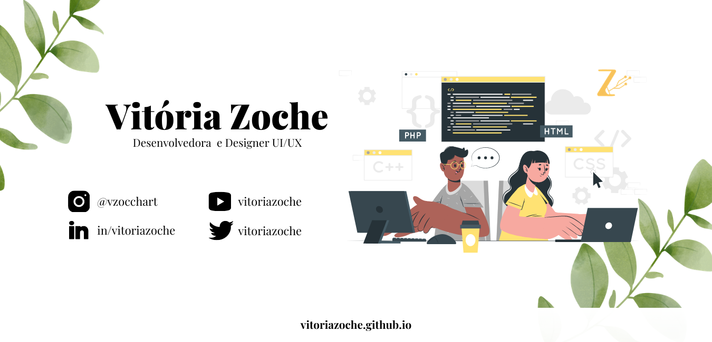

  
 
 
<!-- -->

<table>

   <tr>
   <td>   </td>
    </tr>
</table>

  

## Olá! Seja bem-vindo(a)
### Eu sou a Vitória, sou desenvolvedora e designer de Experiência e Interface do Usuário (UI/UX). Atualmente trabalho como Freelancer em <a href="instagram.com/vzoccheart">@vzoccheart</a>

* Também sou estudante do 3º semestre de Museologia pela UFRGS
* Bolsista no Projeto de Extensão <a href="ufrgs.br/farol">Farol:Conexões da Informação</a>
* Faço trabalhos voluntários de identidade visual e comunicação para outros projetos de extensão. Se você tiver uma proposta pode me enviar um <a href="mailto:vzoccheart@gmail.com">email aqui</a>

### Projetos Recentes
* <a href="https://github.com/vitoriazoche/formHPSP"> GeraFicha: Oficina da Criatividade (OP)</a> - Gerador de Fichas Catalográficas para a OP
* <a href="https://github.com/vitoriazoche/PGDC"> PGDC </a> - Plano de Gestão de Dados Científicos
* <a href="#" title="em breve"> DOARS </a> - Elaboração de identidade visual e interface para uma proposta de TCC

### Hobbies
* Desenhar muuuito no iPad ♥
* Eu jogo algumas coisas na steam, se quiser ser meu amigo eis o código: **252124896**
* Também converso demais no discord, entrem no meu <a href="https://discord.gg/VUnY3gj" style="max-width:100%; margin-bottom:20px;">canalzinho ♥</a>
* E vejo muita, mas muita serié na Netflix

 ### Algumas linguagens e ferramentas que utilizo
<table>
   <tr>
   <td>

   </td>
   </tr>
 
</table>

### Você pode entrar em contato comigo por:
* <a href="vitoriazoche.github.io">Portfólio </a>
* <a href="instagram.com/vzoccheart">Instagram </a>
* <a href="twitter.com/vitoriazoche">Twitter </a>
* <a href="mailto:vzoccheart@gmail.com">E-mail </a>
* <a href="linkedin.com/in/vitoriazoche">Linkedin </a>
* <a href="https://www.figma.com/@vitoriazoche">Figma </a>
* <a href="https://www.youtube.com/channel/UCS3R0Uv_Axyihl4Uk4yRYmA?view_as=subscriber">YouTube </a>

<table style="border:none;">

   <tr>
   <td>   </td>
   <td> <h2> Até a próxima :)</h2></td>
    </tr>
</table>

  